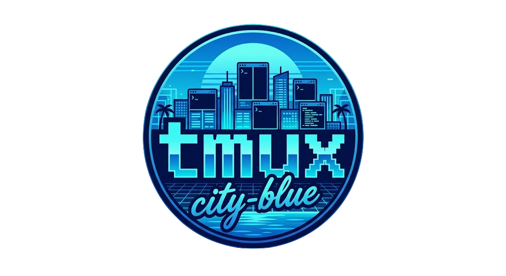

<p align="center">
  
</p>

<h1 align="center">tmux-city-blue</h1>

<p align="center">
  Personal tmux 3.x configuration — modular <code>conf.d/</code> layout, custom
  status-bar scripts, and the <strong>city-blue</strong> theme (standalone,
  native tmux DSL, no theme plugin required).
</p>


> Tested on macOS with tmux 3.6b. Some helpers assume `pbcopy`, `osascript`,
> and a Nerd Font.

## Layout

```
tmux.conf           # entrypoint, source-file's into conf.d/ + theme
conf.d/             # modular configuration
  general.conf      # terminal caps, behavior, status shell
  keybinds.conf     # prefix maps, mouse, popups, menus
  theme.conf        # city-blue widget toggles (@city-blue_*)
  plugins.conf      # tpm plugin list + per-plugin options
scripts/            # ad-hoc status-bar widgets (cpu, ram, k8s, docker, …)
  citypop/          # citypop widget set (forked from janoamaral/tokyo-night-tmux)
    lib/            # palette.sh, coreutils-compat.sh, netspeed-core.sh
themes/
  city-blue.conf    # GENERATED — do not edit; re-run build.sh
build.sh            # regenerate themes/city-blue.conf from palette + glyphs
install.sh          # symlink the repo into $HOME (with backups)
ATTRIBUTION.md      # upstream lineage + what was kept/dropped
```

## Install

```bash
git clone https://github.com/b2nkuu/tmux-city-blue.git ~/code/tmux-city-blue
cd ~/code/tmux-city-blue
./install.sh
```

`install.sh` is idempotent:

- backs up any existing real `~/.tmux.conf`, `~/.tmux/conf.d`, `~/.tmux/scripts`,
  `~/.tmux/themes` with a timestamp suffix
- replaces them with symlinks into this repo
- clones `tmux-plugins/tpm` into `~/.tmux/plugins/tpm` if missing
- runs `build.sh` so `themes/city-blue.conf` is generated with the current
  machine's `$HOME` baked into widget paths
- leaves `~/.tmux/plugins/` (managed by tpm) alone

After install, open tmux and press **prefix + I** to install plugins.

## Theme

`themes/city-blue.conf` is generated by `build.sh` from the citypop palette
plus widget scripts under `scripts/citypop/`. To tweak glyphs or palette, edit
`build.sh` (and `scripts/citypop/lib/palette.sh` for colors) then re-run:

```bash
bash build.sh && tmux source ~/.tmux.conf
```

Widget toggles (git, netspeed, battery, path, hostname, datetime, weather) live
in `conf.d/theme.conf` as `@city-blue_*` options. See `ATTRIBUTION.md` for the
upstream lineage — this repo is a slimmed fork of `citypop-tn`, itself a fork
of [janoamaral/tokyo-night-tmux](https://github.com/janoamaral/tokyo-night-tmux).

## Plugins (tpm)

`tmux-sensible`, `tmux-yank`, `tmux-resurrect`, `tmux-continuum`, `tmux-cpu`,
`tmux-battery`, `tmux-weather`, `tmux-open`, `extrakto`, `tmux-sessionx`,
`tmux-floax`, `vim-tmux-navigator`.

## Acknowledgments

Huge thanks to the authors of the projects this config is built on top of —
this repo is just glue around their work.

**Theme inspiration**

- [janoamaral/tokyo-night-tmux](https://github.com/janoamaral/tokyo-night-tmux) —
  the rounded-badge status-line layout and widget composition that `city-blue`
  is modeled after.

**Plugins**

- [tmux-plugins/tpm](https://github.com/tmux-plugins/tpm) — plugin manager
- [tmux-plugins/tmux-sensible](https://github.com/tmux-plugins/tmux-sensible) — sane defaults
- [tmux-plugins/tmux-yank](https://github.com/tmux-plugins/tmux-yank) — clipboard yank
- [tmux-plugins/tmux-resurrect](https://github.com/tmux-plugins/tmux-resurrect) — session save/restore
- [tmux-plugins/tmux-continuum](https://github.com/tmux-plugins/tmux-continuum) — auto-restore on boot
- [tmux-plugins/tmux-cpu](https://github.com/tmux-plugins/tmux-cpu) — cpu widget
- [tmux-plugins/tmux-battery](https://github.com/tmux-plugins/tmux-battery) — battery widget
- [tmux-plugins/tmux-open](https://github.com/tmux-plugins/tmux-open) — open files/URLs in copy-mode
- [xamut/tmux-weather](https://github.com/xamut/tmux-weather) — weather widget
- [laktak/extrakto](https://github.com/laktak/extrakto) — fuzzy scrollback grab
- [omerxx/tmux-sessionx](https://github.com/omerxx/tmux-sessionx) — fzf session switcher
- [omerxx/tmux-floax](https://github.com/omerxx/tmux-floax) — floating scratch pane
- [christoomey/vim-tmux-navigator](https://github.com/christoomey/vim-tmux-navigator) — seamless vim/tmux pane nav

## License

MIT — see `LICENSE`.
