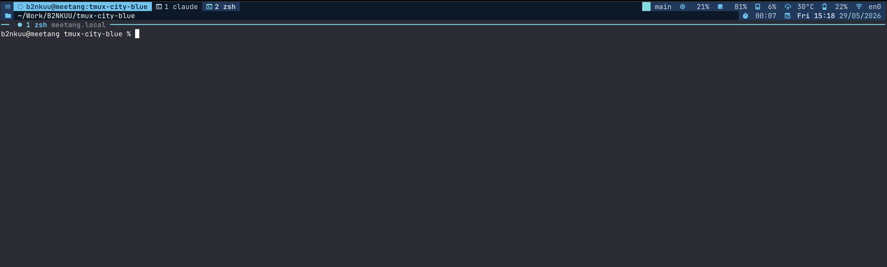

# tmux-city-blue

Personal tmux 3.x configuration — modular `conf.d/` layout, custom status-bar
scripts, and the **city-blue** theme (standalone, native tmux DSL, no theme
plugin required).



> Tested on macOS with tmux 3.6b. Some helpers assume `pbcopy`, `osascript`,
> and a Nerd Font.

## Layout

```
tmux.conf           # entrypoint, source-file's into conf.d/ + theme
conf.d/             # modular configuration
  general.conf      # terminal caps, behavior, status shell
  keybinds.conf     # prefix maps, mouse, popups, menus
  plugins.conf      # tpm plugin list + per-plugin options
scripts/            # status-bar widgets (cpu, ram, git, k8s, weather, …)
themes/
  city-blue.conf      # generated status-line (sourced from tmux.conf)
  build-city-blue.sh  # regenerate city-blue.conf with Nerd Font glyphs
  status-git.sh
install.sh          # symlink the repo into $HOME (with backups)
```

## Install

```bash
git clone https://github.com/b2nkuu/tmux-city-blue.git ~/code/tmux-city-blue
cd ~/code/tmux-city-blue
./install.sh
```

`install.sh` is idempotent:

- backs up any existing real `~/.tmux.conf`, `~/.tmux/conf.d`, `~/.tmux/scripts`,
  `~/.tmux/themes` with a timestamp suffix
- replaces them with symlinks into this repo
- clones `tmux-plugins/tpm` into `~/.tmux/plugins/tpm` if missing
- leaves `~/.tmux/plugins/` (managed by tpm) alone

After install, open tmux and press **prefix + I** to install plugins.

## Theme

`themes/city-blue.conf` is a self-contained status-line written in native tmux
DSL — no `tokyo-night-tmux` (or any theme plugin) needed at runtime. To tweak
glyphs or palette, edit `themes/build-city-blue.sh` and re-run it:

```bash
bash themes/build-city-blue.sh && tmux source ~/.tmux.conf
```

The layout was originally inspired by
[janoamaral/tokyo-night-tmux](https://github.com/janoamaral/tokyo-night-tmux);
this repo carries no upstream code.

## Plugins (tpm)

`tmux-sensible`, `tmux-yank`, `tmux-resurrect`, `tmux-continuum`, `tmux-cpu`,
`tmux-battery`, `tmux-weather`, `tmux-open`, `extrakto`, `tmux-sessionx`,
`tmux-floax`, `tmux-pomodoro-plus`, `tmux-fzf`, `vim-tmux-navigator`.

## Acknowledgments

Huge thanks to the authors of the projects this config is built on top of —
this repo is just glue around their work.

**Theme inspiration**

- [janoamaral/tokyo-night-tmux](https://github.com/janoamaral/tokyo-night-tmux) —
  the rounded-badge status-line layout and widget composition that `city-blue`
  is modeled after.

**Plugins**

- [tmux-plugins/tpm](https://github.com/tmux-plugins/tpm) — plugin manager
- [tmux-plugins/tmux-sensible](https://github.com/tmux-plugins/tmux-sensible) — sane defaults
- [tmux-plugins/tmux-yank](https://github.com/tmux-plugins/tmux-yank) — clipboard yank
- [tmux-plugins/tmux-resurrect](https://github.com/tmux-plugins/tmux-resurrect) — session save/restore
- [tmux-plugins/tmux-continuum](https://github.com/tmux-plugins/tmux-continuum) — auto-restore on boot
- [tmux-plugins/tmux-cpu](https://github.com/tmux-plugins/tmux-cpu) — cpu widget
- [tmux-plugins/tmux-battery](https://github.com/tmux-plugins/tmux-battery) — battery widget
- [tmux-plugins/tmux-open](https://github.com/tmux-plugins/tmux-open) — open files/URLs in copy-mode
- [xamut/tmux-weather](https://github.com/xamut/tmux-weather) — weather widget
- [laktak/extrakto](https://github.com/laktak/extrakto) — fuzzy scrollback grab
- [omerxx/tmux-sessionx](https://github.com/omerxx/tmux-sessionx) — fzf session switcher
- [omerxx/tmux-floax](https://github.com/omerxx/tmux-floax) — floating scratch pane
- [olimorris/tmux-pomodoro-plus](https://github.com/olimorris/tmux-pomodoro-plus) — pomodoro timer
- [sainnhe/tmux-fzf](https://github.com/sainnhe/tmux-fzf) — fuzzy command menu
- [christoomey/vim-tmux-navigator](https://github.com/christoomey/vim-tmux-navigator) — seamless vim/tmux pane nav

## License

MIT — see `LICENSE`.
